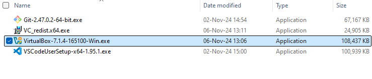
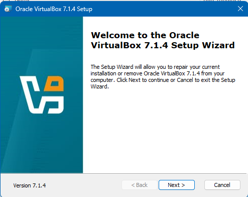
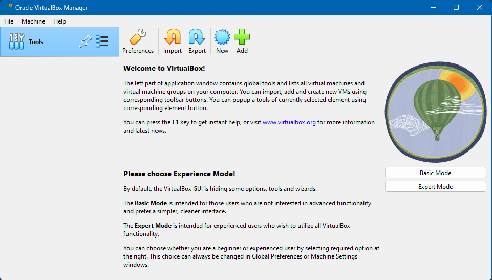

# Virtual Machines

## Installation of VirtualBox

Go to [VirtualBox download webpage](https://www.virtualbox.org/wiki/Downloads)
and download VirtualBox for your operating system, in my case it will be Windows 11.

After process of downloading select VirtualBox .exe file and proceed to installation process

You need to press **Next** button several times

When installation will be completed, start VirtualBox. Result will be according to this:

