# Virtual Machines

## Installation of VirtualBox

Go to [VirtualBox download webpage](https://www.virtualbox.org/wiki/Downloads)
and download VirtualBox for your operating system, in my case it will be Windows 11.

After process of downloading select VirtualBox .exe file and proceed to installation process

You need to press **Next** button several times

When installation will be completed, start VirtualBox. Result will be according to this:

## Windows OS installation on VM

Go to [Microsoft Evaluation Center](https://www.microsoft.com/en-us/evalcenter)
and under **Windows** submenu select **Windows 11 Enterprise**

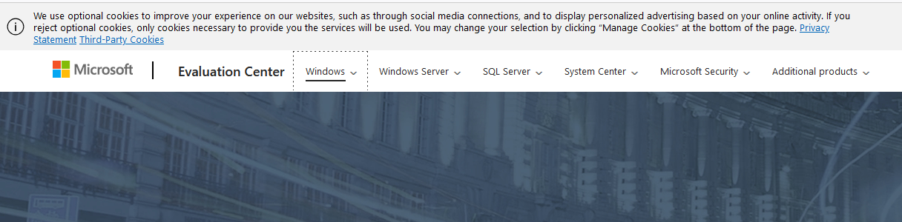

You'll see a webpage with options to download ISO file. Select **Download the ISO - Windows 11 Enterprise >**

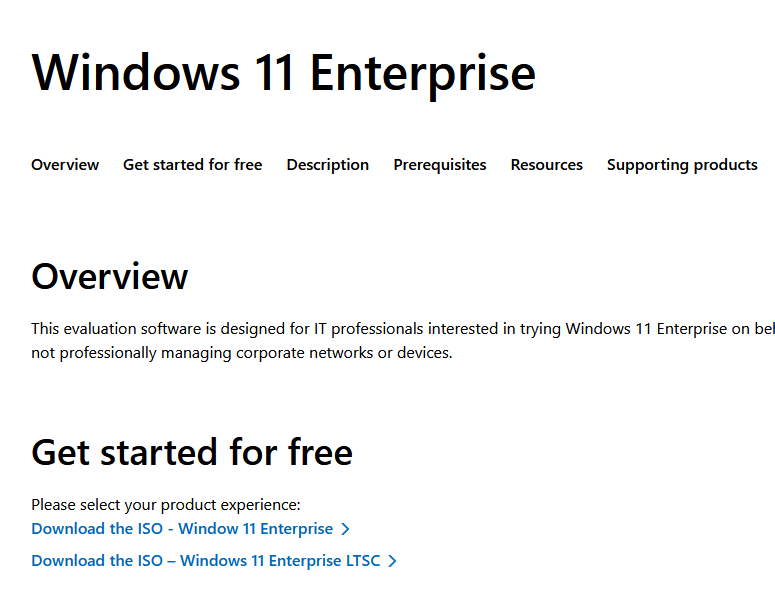

After that you need to fill up the form in order to start process of downloading ISO file,
it is not required to fill up the form with real data. I will use dummy data as shown:

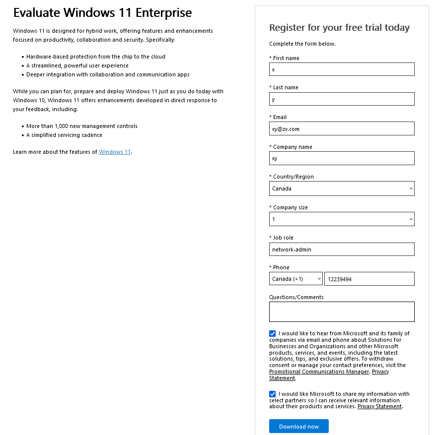

Now you need to choose language for the system and edition. I will go with **English (United States) ISO - Enterprise download - 64 bit edition**

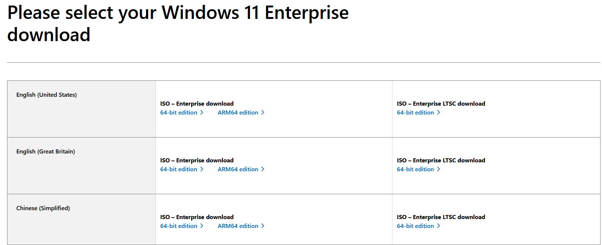

After completion of downloading you should have ISO file of **Win11 Enterprise** in Downloads folder

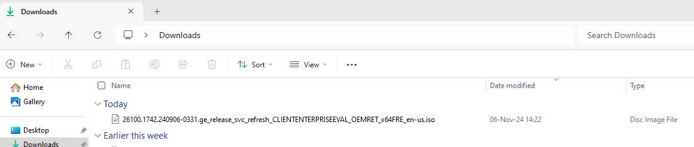

Open VirtualBox Manager and select **New**

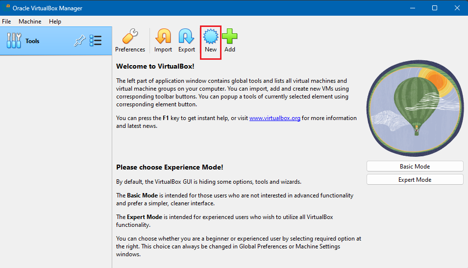

In the wizard you need to fill up fields like Name, Folder for storing VM, ISO image of the system, and I checked **Skip Unattended Installation** to install Operating System manually.
By default, VirtualBox offers an unattended installation feature, which automates the setup of the guest operating system by pre-configuring settings like username, password, and other installation parameters. This can save time and effort, especially for repetitive tasks or automated deployments

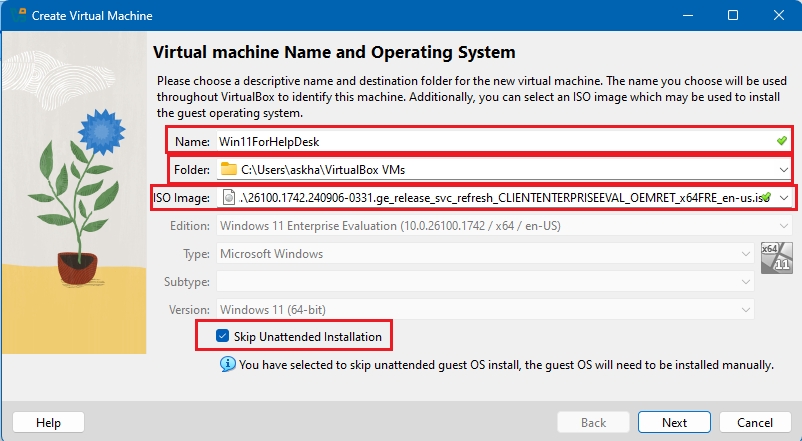

Next we need to setup memory size and cpu, I will use 8192 MB and 4 cores of cpu

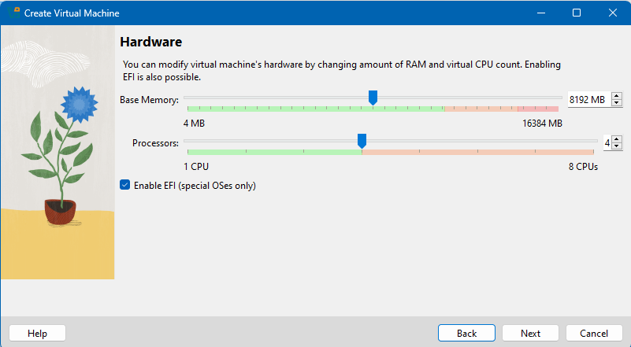

Next step is to allocate hard disk size, in my case it will be default

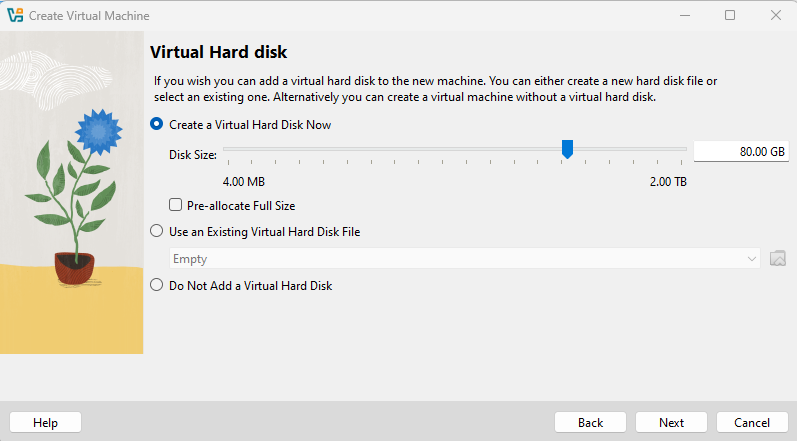

Next you will see summary for configuration of VM. All you need is to click **Finish** button to complete the process

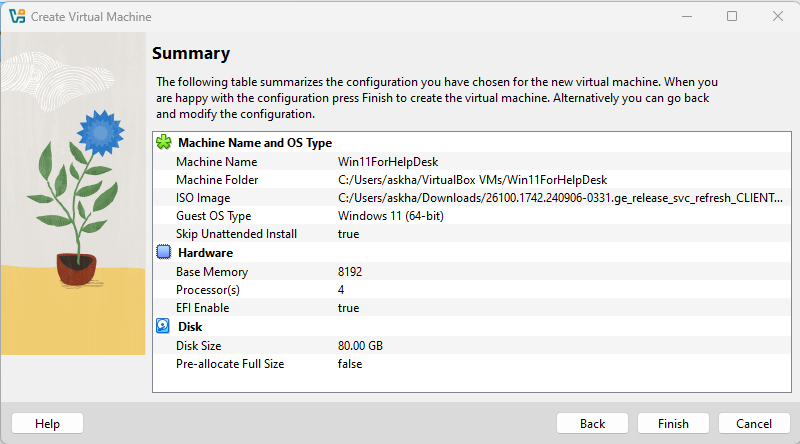

As a result you will see following:

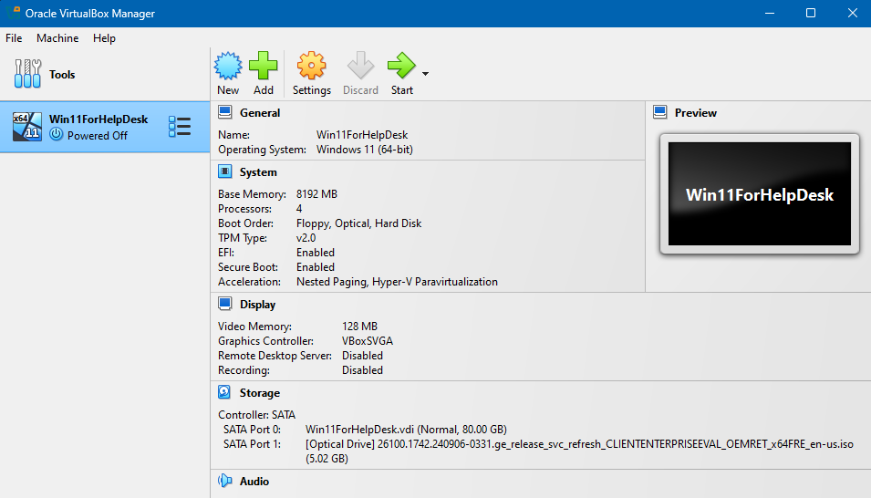

Now it is time to power up our VM. Select VM and click **Start**

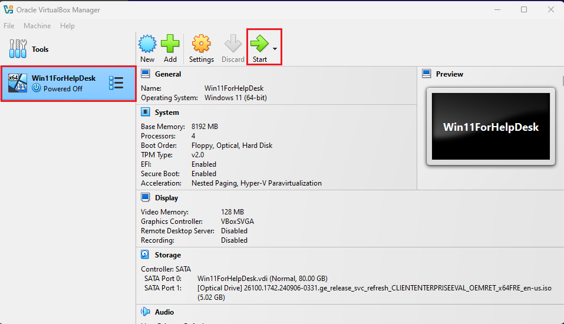

When window with VM will open you need to press any button several times. After that a process of booting system will start. Next you will see following, I will use default setting during installation of Windows. Click **Next**

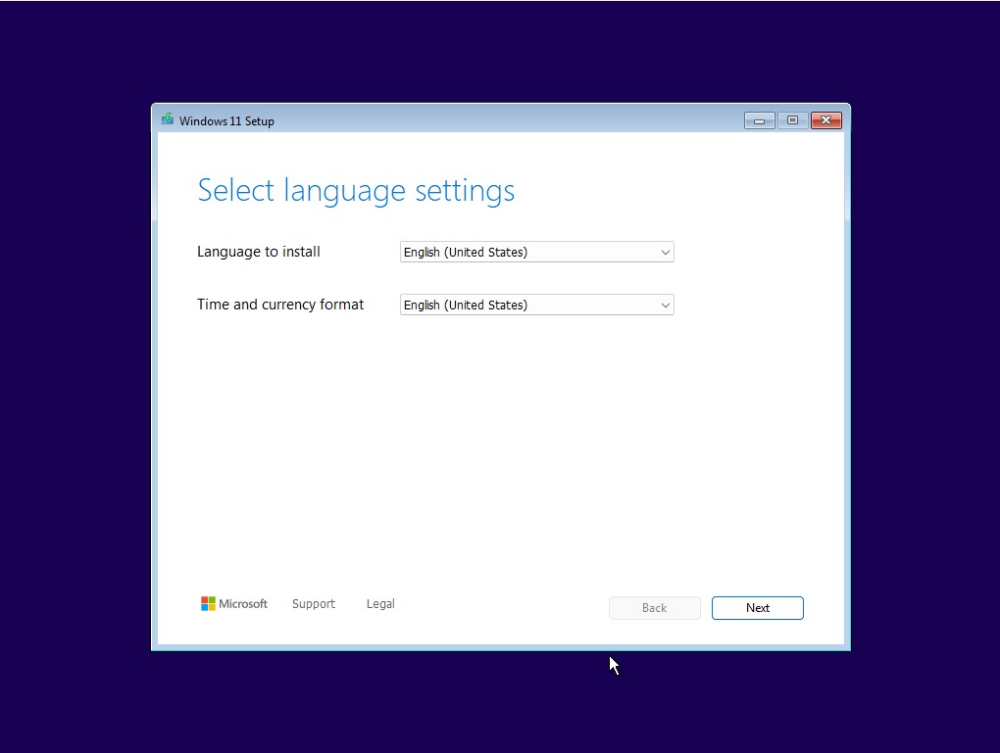

Click **Next**

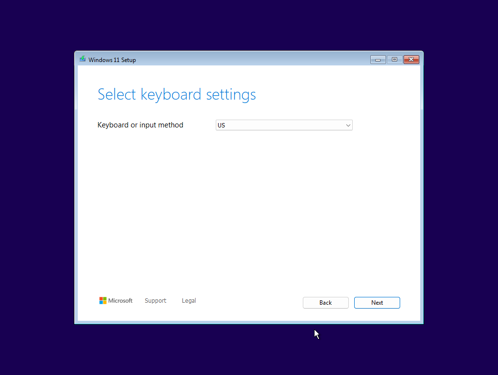

I select **Install Windows 11** 

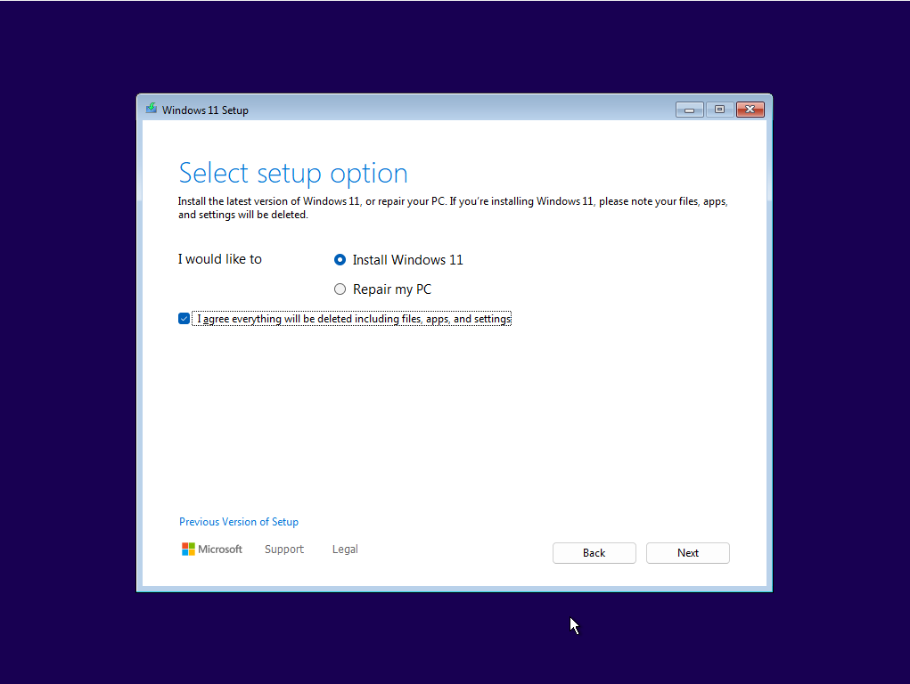

Accept **Terms and Licenses**

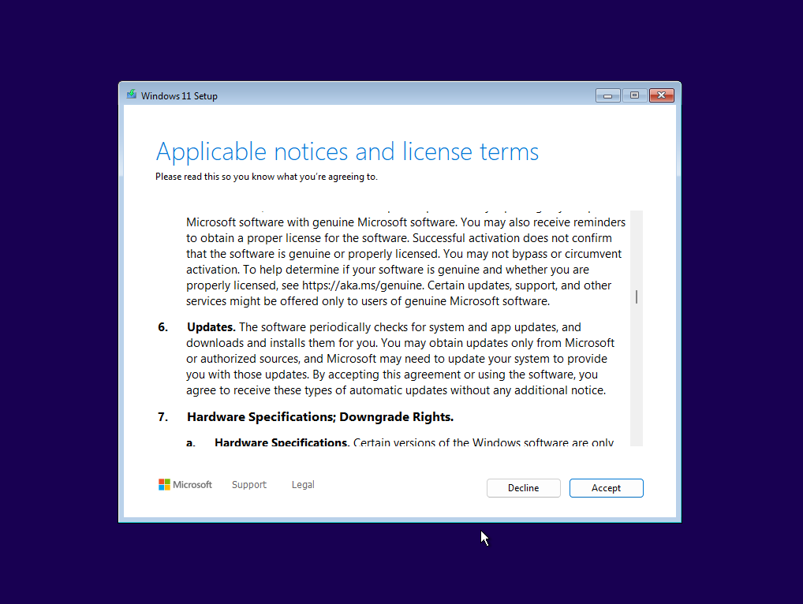

Select disk and click **Next**

After process of installation is completed you will see screen to create a new user account.
Under **Email** field you could find **Sign-in options** which you need to select. Next you will see a list with available options and you need to click on **Domain Join Instead**. After those steps you will see following:

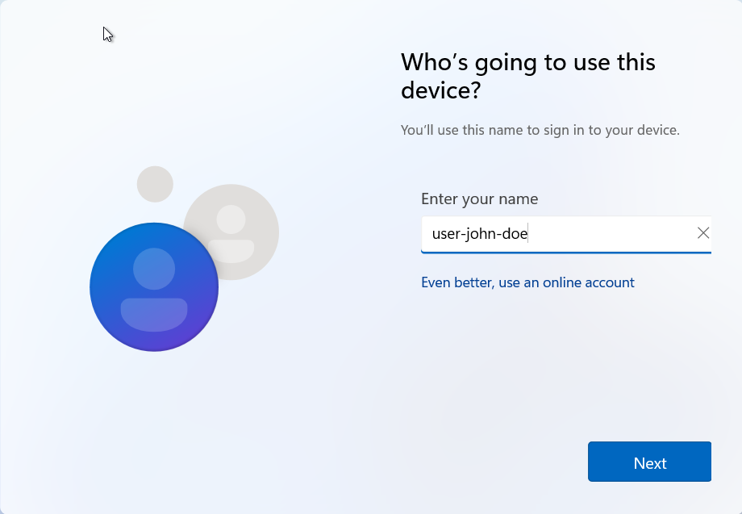

Create your username and proceed to password form

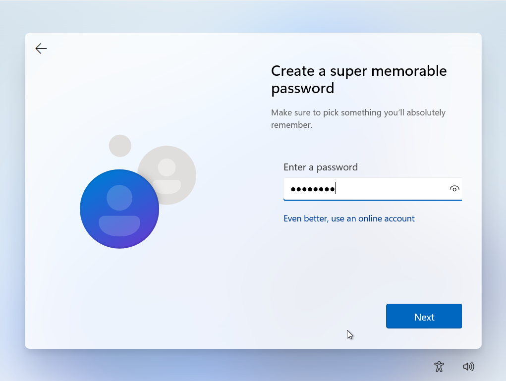

Also the system will ask you to select 3 secret questions and answers to it. After all these steps and completion of installation, you can login to your new system and will see Windows 11 desktop

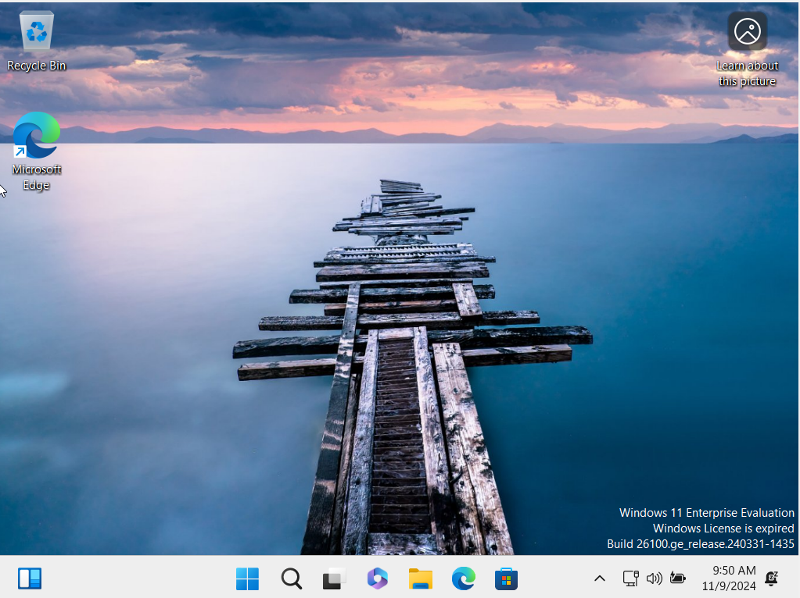