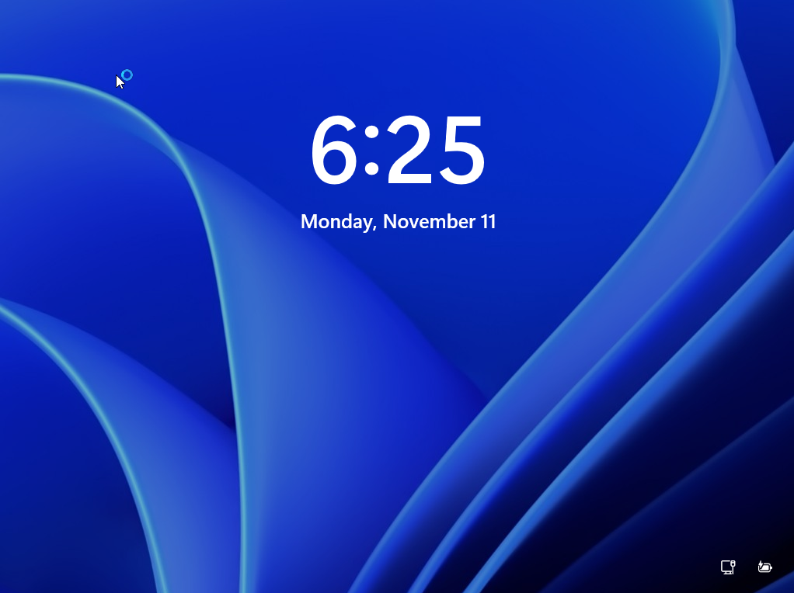
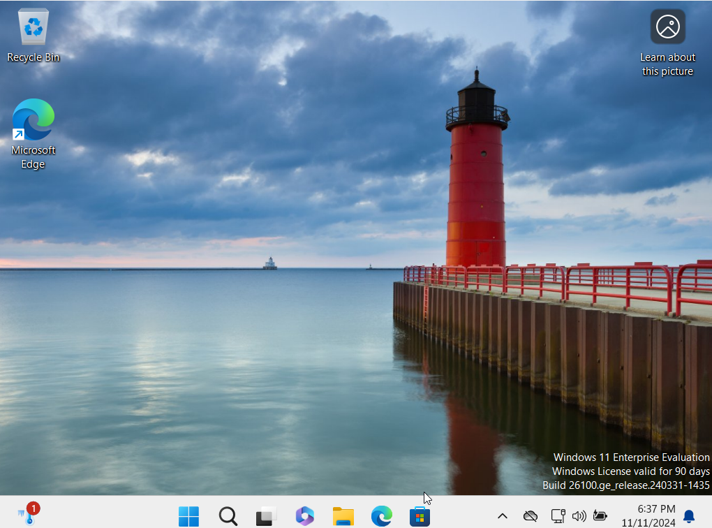
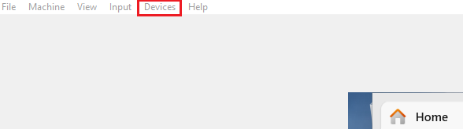
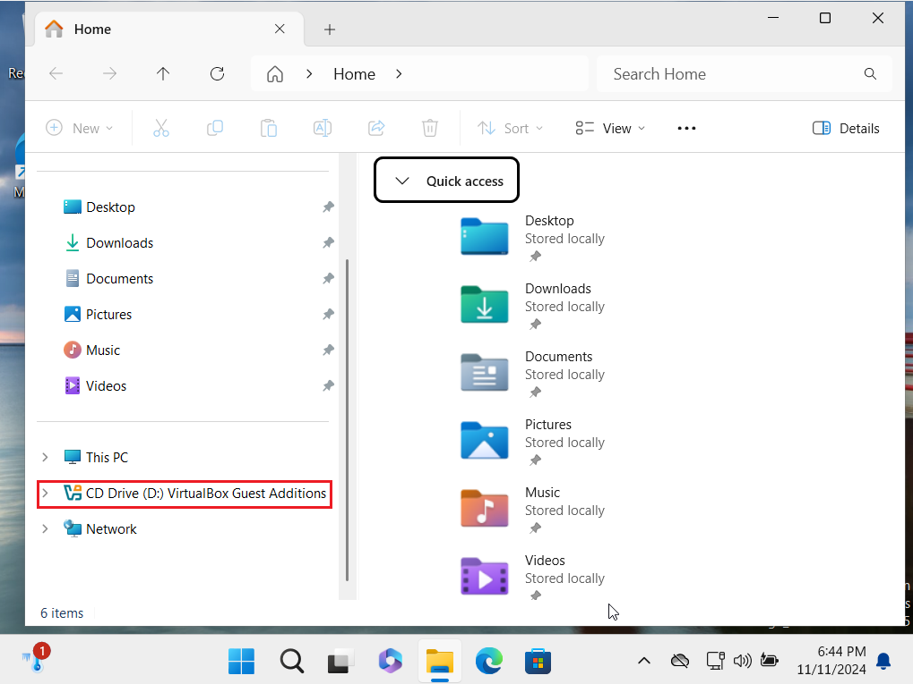
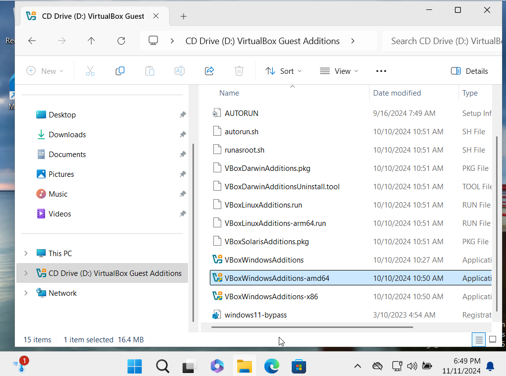
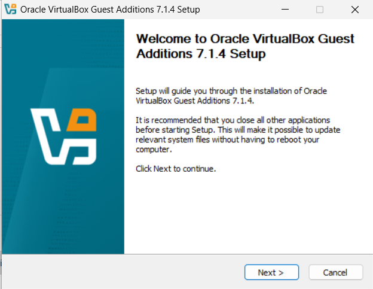

# Installation of Guest Additions

**Reason:** VirtualBox Guest Additions enhance virtual machine performance and usability by providing features like seamless mouse integration, optimized graphics, and shared clipboard functionality. They allow for better data transfer, efficient window management, and improved network performance, making it easier for administrators to manage and interact with virtual environments. These additions ultimately make the virtual machine experience more user-friendly and efficient.

Open VirtualBox Manager and power on your VM with Windows 11 Operating system

Next use your user and password to login

In your window of your VM select submenu **Devices** and option **Insert Guest Additions CD Image** 

If nothing is happening, open **File Explorer** and you should see similar to image below

Open it and find **VBoxWindowsAdditions-Amd64.exe**, and you need to run it as administrator

In Setup Manager I will use default settings, so just click **Next**

After completion of installation it will ask to reboot the system.