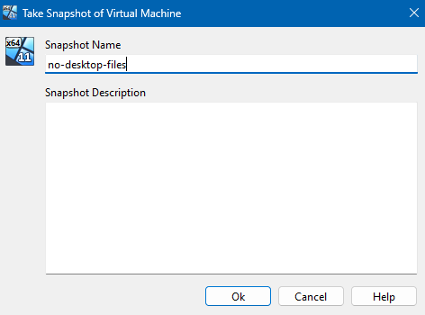
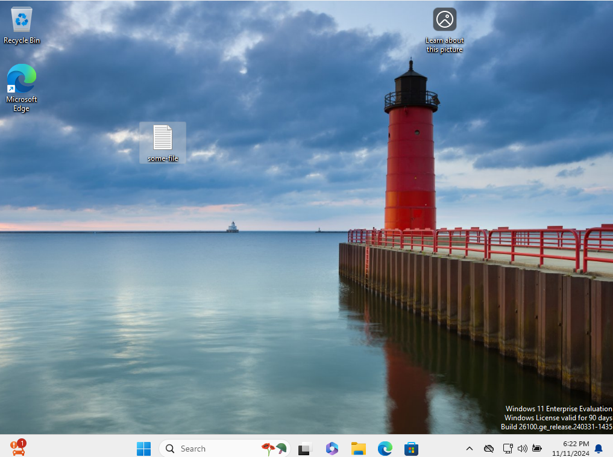
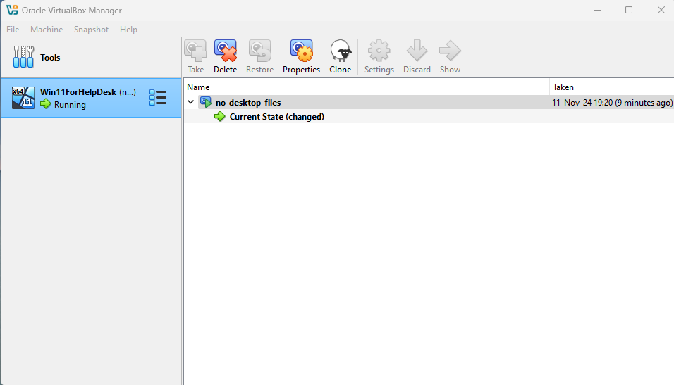
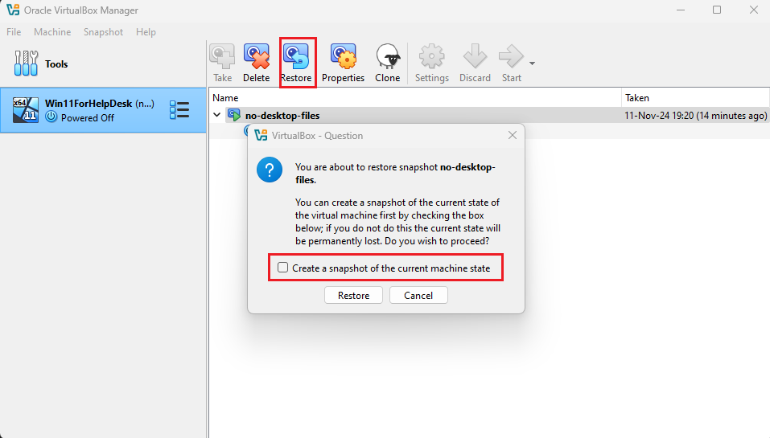
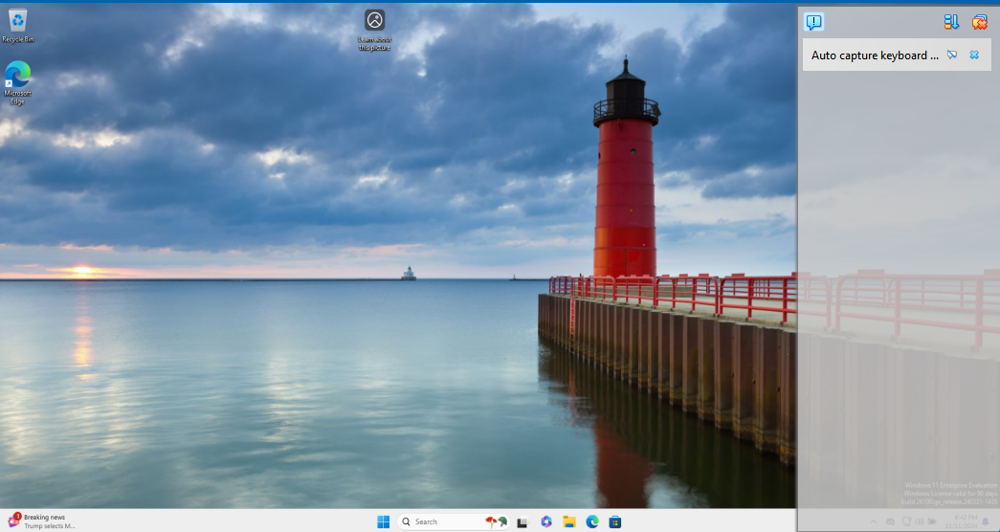

# Snapshots of VM. How to take it and how to restore it

**Info:** Snapshots in VirtualBox let you save the state of a virtual machine at a specific point in time, allowing for easy rollbacks if something goes wrong. They provide a safety net for testing different configurations or software installations without permanent changes. This makes snapshots invaluable for efficient testing and quick recovery in virtual environments.

Power on your VM with Windows Operating system

In your window of VM select submenu **Machine** and then option **Take a snapshot**. 

You will see a form to put a name for a snapshot. Use any name and click **Ok**

It will take some time to create a snapshot. Now lets create a text file and save it on desktop. My file also has some text.

Now open your VirtualBox Manager and click on **List** badge and you will see menu options.

You need to select **Snapshots**. You will see something similar

As you see now we have to states of VM. First one it is snapshot before creating text file, second one is current state of our VM with created text file.

Now we are going to restore our snapshot and check changes to VM state. Power Off your VM.
I selected my snapshot and clicked **Restore** and in open window I removed checkbox **Create snapshot of current state machine**

Now lets power on our VM and check our text file

As you see we don't see our text file. And it is because we restored our VM state from the snapshot we took before creating the text file.